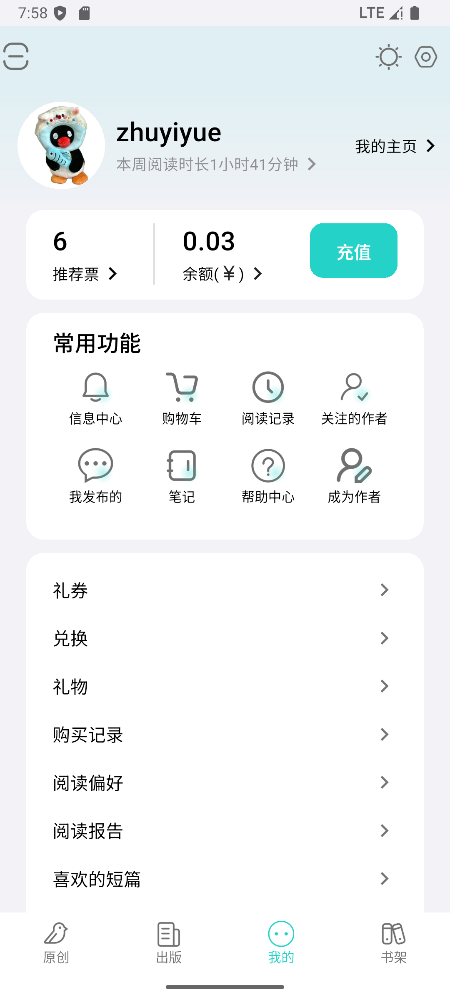
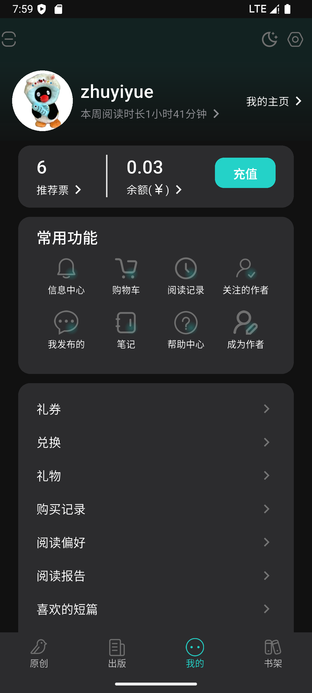
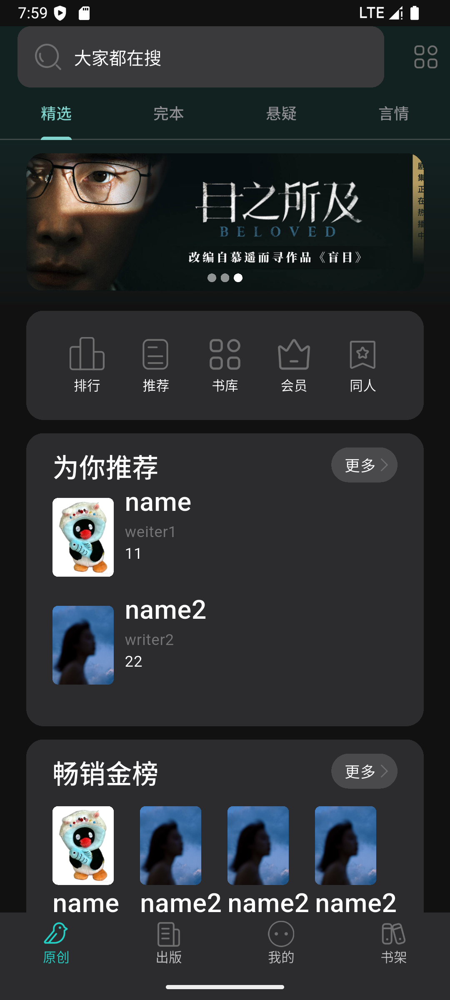
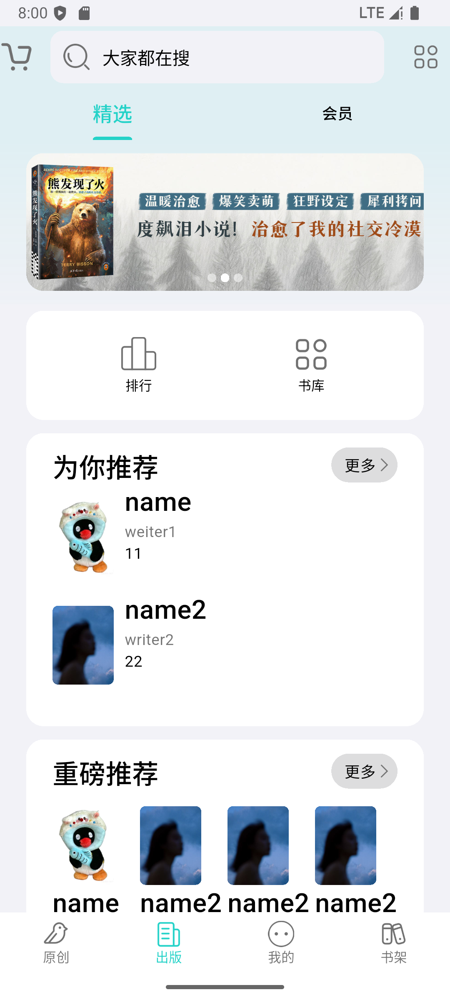

# douban_reading_clone

## 项目概述

这是一个基于Flutter开发的douban_reading_clone，

## 🚀 技术栈

- **开发语言**: Dart
- **框架**: Flutter
- **状态管理**: Provider
- **数据存储**: Isar
- **国际化**: Flutter Localization
- **平台支持**: Android, iOS, Web, Windows, Linux, macOS

## 📸 项目截图

- **主题切换**:

<table>
    <tr>
    <td>我的</td>
    <td>我的 暗夜模式</td>
  </tr>
  <tr>
    <td></td>
    <td></td>
  </tr>
      <tr>
    <td>原创</td>
    <td>出版</td>
  </tr>
    <tr>
        <td></td>
        <td></td>
    </tr>
</table>